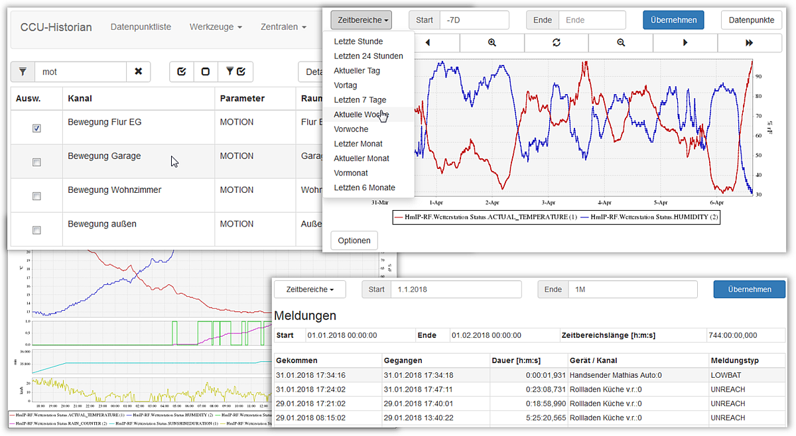
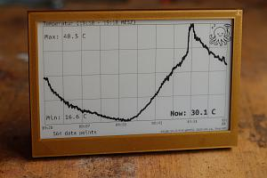
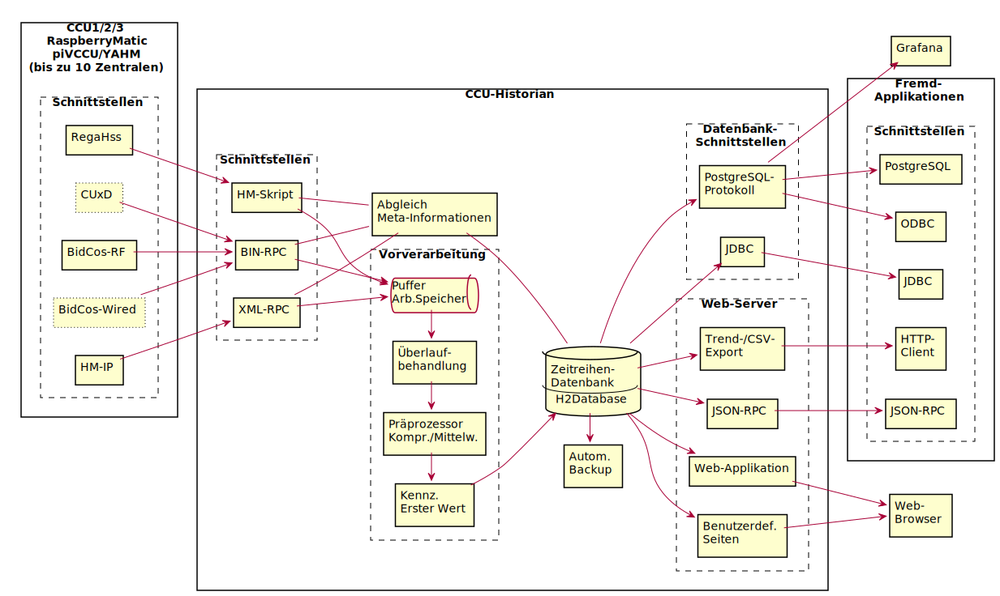

# CCU-Historian

Langzeitarchiv für die Zentrale (CCU) des Hausautomations-Systems HomeMatic.

Der CCU-Historian ist ein Langzeitarchiv für die Zentrale (CCU) des [Hausautomations-Systems](http://de.wikipedia.org/wiki/Hausautomation) HomeMatic der Firma [eQ-3](http://www.eq-3.de/).

Die Kommunikationsvorgänge der CCU-Schnittstellen (BidCos-RF, BidCos-Wired und System) werden aufgezeichnet. Darunter befinden sich z.B. die Messwerte aller Sensoren und alle ausgeführten Schaltvorgänge. Aus der Logikschicht der CCU werden zusätzlich die Systemvariablen archiviert. Die gesammelten Daten werden strukturiert in einer Datenbank abgelegt und stehen daraufhin für Visualisierungen oder Analysen zur Verfügung. Für einen ersten Überblick werden Web-Seiten mit Trend-Diagrammen durch einen eingebetteten Web-Server generiert.

Mit vielen tausend Installationen erfreut sich der CCU-Historian bei den HomeMatic-Anwendern einer großen Beliebtheit.

**[Viele weitere Informationen sind im umfangreichen Handbuch zu finden.](https://github.com/mdzio/ccu-historian/wiki)**

## Interessantes aus der Community

In diesem Abschnitt will ich immer Neues und Interessantes aus der CCU-Historian Community vorstellen. Dieses Mal bin ich auf die batteriebetriebene ePaper-Anzeige **inki** aufmerksam geworden, die als Datenquelle für Trendkurven den CCU-Historian verwendet. Das Projekt liegt ebenfalls auf [GitHub](https://github.com/c0de111/inki) und wird auch auf [Hackaday.io](https://hackaday.io/project/203726-inki-low-power-wireless-epaper-device) vorgestellt.

## Übersicht

Das folgende Diagramm zeigt die einzelnen Komponenten des CCU-Historians:

## Unterstützte Plattformen

Da der CCU-Historian nur eine [Java-Laufzeitumgebung](https://java.com/) zum Betrieb voraus setzt, ist er auf etlichen Hard- und Software-Plattformen lauffähig:

* Windows / Linux / MacOS
* x86 / x64 / ARM

Für bestimmte Systeme existieren fertige Installationspakete:

* CCU-Addon für folgende HomeMatic-Zentralen:
  * CCU3
  * [RaspberryMatic](https://github.com/jens-maus/RaspberryMatic)
* Synology-Paket (DSM Version 6 und 7)
* Docker-Image
  * [mdzio/ccu-historian](https://hub.docker.com/r/mdzio/ccu-historian)

**Hinweis:** Für den Betrieb als Addon auf einer CCU3 oder RaspberryMatic muss an der Zentrale ein USB-Stick oder vorzugsweise eine USB-SSD angeschlossen sein!

## Installationspakete

Die Installationspakete sind bei den [Veröffentlichungen](https://github.com/mdzio/ccu-historian/releases) zu finden.

## Installation und Konfiguration

Die Installation und Konfiguration ist im [Handbuch](https://github.com/mdzio/ccu-historian/wiki#installation) ausführlich beschrieben.

## Entwicklungsumgebung

Der CCU-Historian ist größtenteils in der [Programmiersprache Apache Groovy](http://groovy-lang.org) geschrieben. Weitere Programmiersprachen sind Java und JavaScript. Als Entwicklungsumgebung wird die [Eclipse IDE](http://www.eclipse.org) ab der V2025-03 in der Variante für Java-Entwickler verwendet. Das Paket ist auf der [Download-Seite](https://www.eclipse.org/downloads/packages/) zu finden. Des Weiteren wird das [Groovy-Eclipse-Plugin](https://github.com/groovy/groovy-eclipse/wiki) ab der V5.7.0 benötigt. Dieses Plugin ist im Eclipse Marketplace (*Help* → *Eclipse Marketplace*) zu finden und sollte automatisch zur Installation angeboten werden, wenn das CCU-Historian-Projekt importiert wird. Über *File* → *Import* → *Projects from Git* kann direkt das Repository geklont werden. Die Zielplattform ist Java Version 11.

Alle Beiträge zum Projekt müssen unter die [GNU General Public License V3](LICENSE.txt) gestellt werden. Die Lizenzen von verwendeten Bibliotheken müssen mit dieser kompatibel sein.

## Lizenz und Haftungsausschluss

Dieses Projekt steht unter der [GNU General Public License V3](LICENSE.txt) mit folgenden Ausnahmen:

* Highstock/Highcharts JS: [Creative Commons (CC) Attribution-NonCommercial licence](http://creativecommons.org/licenses/by-nc/3.0/)

Bei einer kommerziellen Verwendung des CCU-Historians muss also auf die Erweiterung H2-Highcharts verzichtet werden, oder eine entsprechende Lizenz erworben werden.

Die Lizenzen von allen Abhängigkeiten sind im Ordner [dist-generic/src/third-party-licenses](https://github.com/mdzio/ccu-historian/tree/master/dist-generic/src/third-party-licenses) zu finden.

## Autoren

Copyright (c) 2011-2025

* [Mathias Dzionsko](https://github.com/mdzio) (Projektleiter, Hauptentwickler)
* [Jens Maus](https://github.com/jens-maus) (CCU/RaspberryMatic-Distribution)
* [hotroot](https://github.com/hotroot), Yannick Rocks, [Thomas Zahari](https://github.com/tzahari) (Synology-Distribution)
* [D. Domig](https://github.com/jokay) (Docker Image)
* [wak](https://github.com/wakr70) (Erweiterung H2-Highcharts)
* Wolfgang Schneiderhan (SVG-Trend)
